# LA104 pocket logic analyser operating system

LA104 is another nice piece of handheld hardware coming from [e-design / miniware company](http://www.miniware.com.cn/) similar to their previous product - pocket digital storage oscillosope DS203. 

This time they designed wholly digital device without analog circuitry featuring 4 general purpose IO signals and 4 digital inputs processed by [AG1K FPGA chip](http://www.alta-gate.com/products.aspx?id=43&p=14), the processor used is the same as in DS203 - STM32F103VCT6. Device is battery powered, charged through USB micro connector, its display (ILI9341) offers resolution of 320x240 pixels and the storage EEPROM has this time capacity of 8MB. Check the [scheme here](resources/LA104%20V1.5B_SCH.pdf)

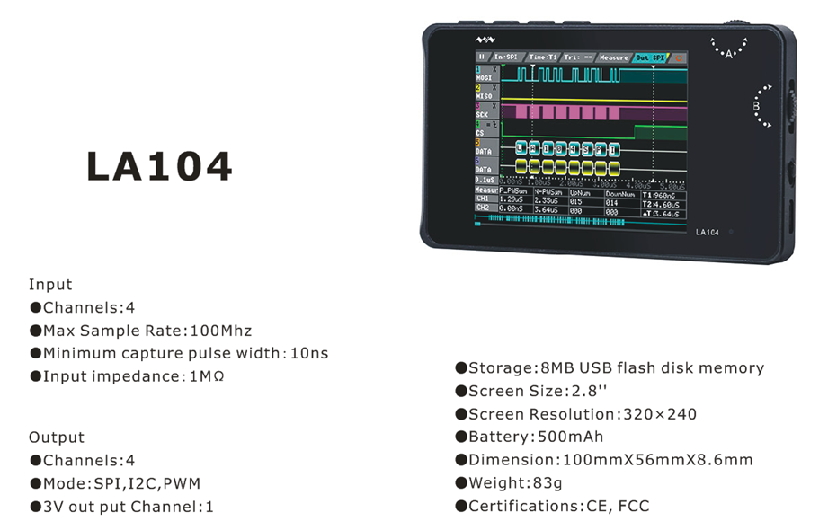

Flashing is done by holding first function button during powering up and by copying firmware HEX file onto the virtual flash USB drive formatted as FAT12. This could be tricky, since this approach does not work on Mac OSX. For some reason the default copying procedure after mounting this USB drive on OSX is different than the programmers at e-design expected, it works reliably only on Windows machines. During extensive research and testing I found a method how to upload firmware on any unix/linux operating system. Just build [tools/dfuload](tools/dfuload) by running build.sh script and you are ready to flash new firmwares. 

When I was developing alternative firmware for DS203, I was trying to design some simple operating system that would allow me to upload easily new programs to the devie with ability to switch between them without flashing it again. Something similar that [jpa did before](https://jpa.kapsi.fi/dsoquad/) with his PAWN interpreter on DS203 with a little difference that the application will be native C/C++ compiled code offering full computational power of the device. Unfortunately the GCC toolchain I was using had some bug which produced ARM32 instructions in PLT section which are not supported by STM32F103 and I was not able to force the compiler to use Thumb instruction set. So the dynamic relocation of imported symbols was an impossible task to implement. Now after few years, this problem was fixed and finally I could continue developing this operating system I have started before.

#### Installation

Go to release section on top of this page, download *system.hex*. Power on the LA104 while holding first button. Connect the device using USB cable with your computer. New disk drive should appear, copy the *system.hex* file there. The disk should disconnect and reconnect shortly after the upload was finished. If you are lucky, you will see *manager.rdy* on the disk. Turn the unit off and on and copy remaining files from zip archive *approot.zip* to your device. After power cycle a gui should appear. If the file system does not appear stable, you can format it using [tools/dfuload](tools/dfuload/format.sh) script.


#### News

##### EInk display image loader

- Application [90_epd_image](system/apps_featured/90_epd_image/) loads BMP images and transfers them into the eink display

##### RF Toolkit

Ultimate toolkit for hacking OOK/ASK wireless devices (weather stations, wireless keys...) using CC1101 transceiver

[](https://www.youtube.com/watch?v=Gwyi00NKBNg "LA104 RF Toolkit")

- RF Toolit application: [80_rftool](system/apps_featured/80_rftool/)
- Spectrum analyser: [82_specan](system/apps/82_specan/)
- Web usb signal analyser: [79_cc1101osc](system/apps/79_cc1101osc/)

##### Building tutorial

Read more [here](resources/tutorial_building)

##### (LA104) Variable frequency drive visualizer

This app uses RS485 adapter to talk to Invt Good drive inverters. Read more [here](system/apps_featured/74_invtvisual), besides the visualization tool, there is also [application](system/apps_experiments/75_invtemu) which emulates GD100 VFD (as seen on the picture)... Watch video:

[](https://www.youtube.com/watch?v=0Ns7AHVvmX0 "VFD talking to LA104 over RS485")

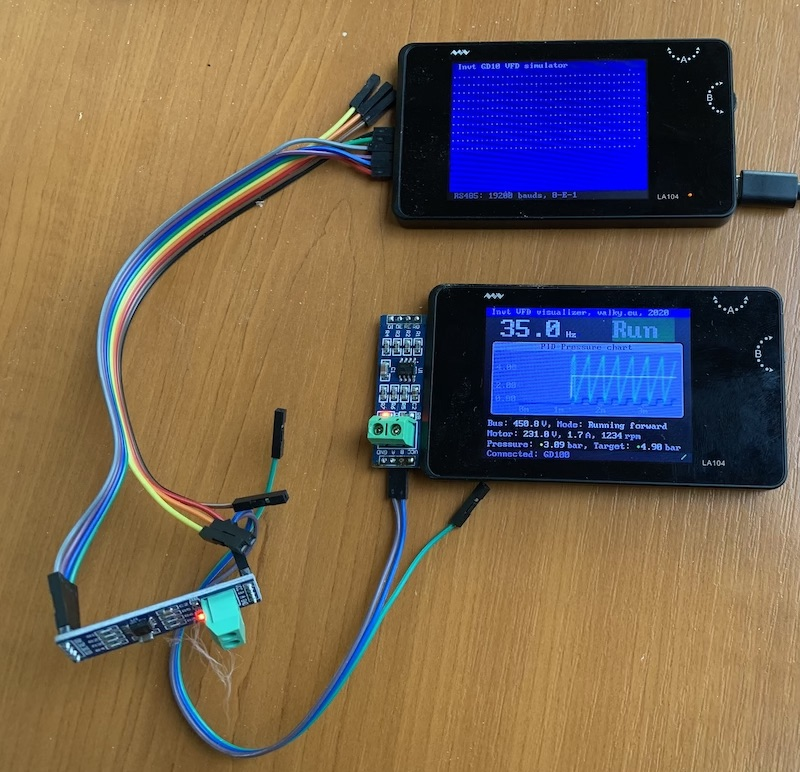


##### WASM experimental evironment

You the experience of using LA104 analyser in [your browser](https://rawgit.valky.eu/gabonator/LA104/master/system/release/wasm/index.html)


##### (DS203) Web USB Oscilloscope

Proud to announce the first oscilloscope in the world using the WebUsb technology (correct me if I am wrong)! [Read more here](system/apps_featured/69_webusbosc/readme.md)

Watch video here:

[](https://www.youtube.com/watch?v=aghTg4Pggv4 "WebUsb Oscilloscope")

##### Addressable RGB led strip tester

Addressable LED tester with advanced functions. Supports up to 32x WS2812/WS2812/SK6812 and other compatible addressable LED modules. More than 15 static and dynamic color presets, speed control, 8 different filter post-process options... Possible to build for OSX as desktop application, or LA104 native app or as [WASM based HTML application. Try it online here!](http://rawgit.valky.eu/gabonator/LA104/master/system/apps_featured/test63_ws2812/build_wasm/index.html) Watch video below:

[](https://www.youtube.com/watch?v=4fWqZBbjQPc "LA104 with addressable leds")

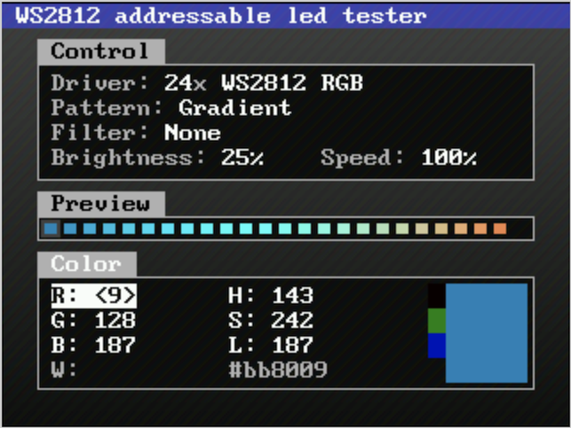

##### Temperature grapher

Shows temperature of up to 8 DS1820 sensors in form of graph. Automatic export of measured values into [html](https://rawgit.valky.eu/gabonator/LA104/master/system/apps_featured/test33_temper/visualize/TEMPER01.HTM), [source code](system/apps_featured/test33_temper/visualize/TEMPER01.HTM).

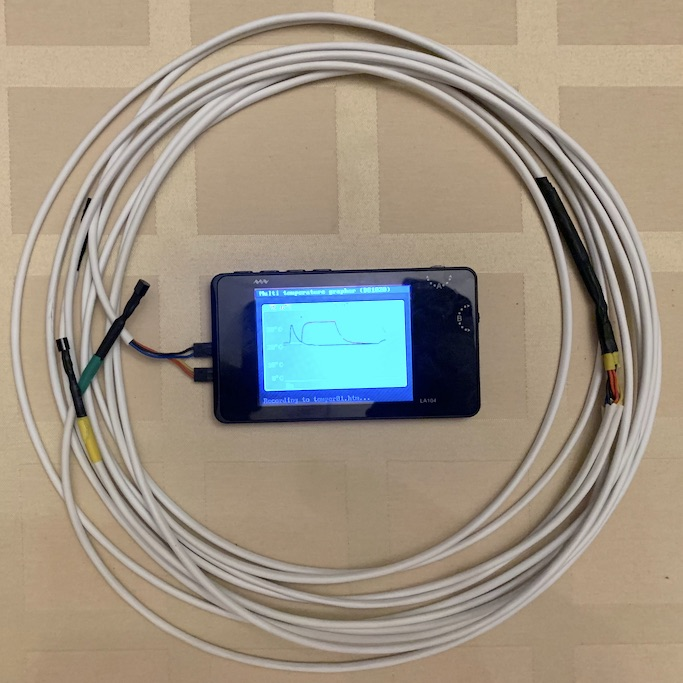
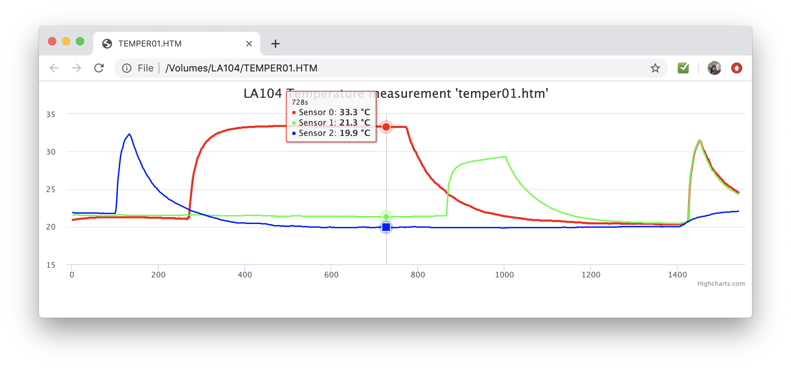

##### One firmware to rule them all

Operating system developed as a part of this project was ported to other handheld devices from miniware (DS203 rev. 2.60, DS213, LA104). Still in early development stage, but looks very promising.


##### Dream SAM2695

LA104 playing midi on SAM2695 wavetable synthesizer through UART:

[](https://www.youtube.com/watch?v=f3DCqy-3lNo "LA104 playing on SAM2695")

##### Simcom driver

Simcom 800L driver with nice interface, sends 6 HTTP (get/post/json) requests in one minute. [test45_simcom](system/apps/test45_simcom)

##### GPIO Tool

Allows to monitor logic level on all 8 pins, the P1-P4 pins can be used as outputs. In PWM tab it is possible to set the PWM frequency and PWM levels for P1-P4 pins, including exponential compensation curve or automatic quasi-periodic animation of all outputs.

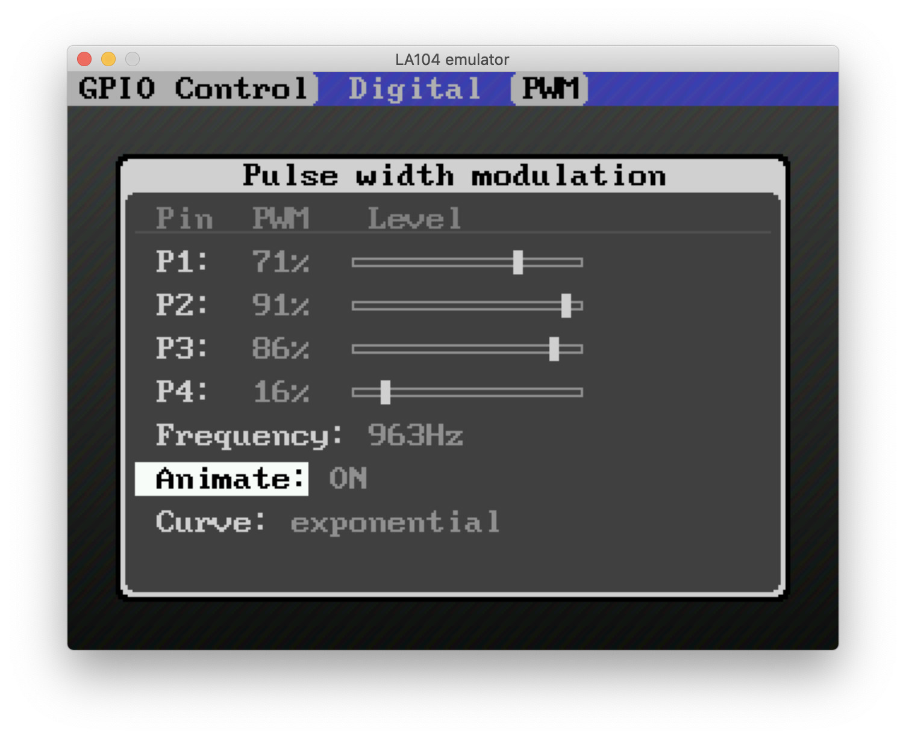

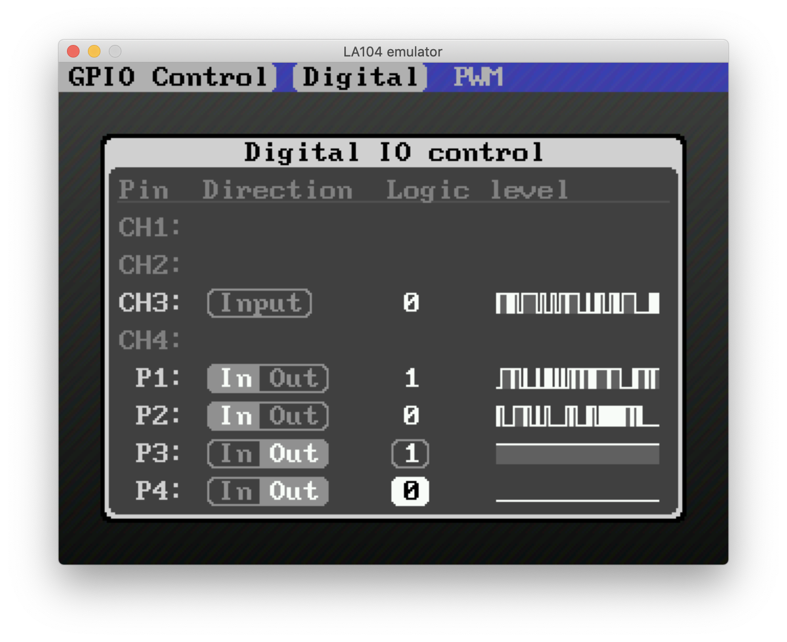


##### Wave alchemy

Currently in development stage. App sniffs for wireless transmission using CC1101 transceiver, automatically decodes the protocol (wireless weather station, KEELOQ keyfob packets, fixed code remote controls, rolling code remote controls). To aid the decoding process, app displays the sniffed signal in form of histogram for easy identification of protocol (manchester encoding, pause length encoding) and its timing. Recorded signal can be stored in flash or transferred to PC for further analysis. Stored signals can be replayed to perform replay attack in case of fixed code sequence. Besides support of CC1101 chip, this app can be used in conjunction with infrared receiver and infrared diode to record and replay IR control codes for TV set or another consumer electronics.

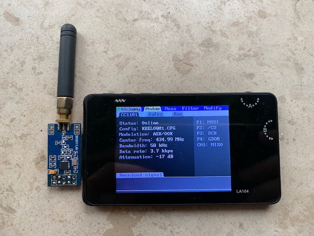

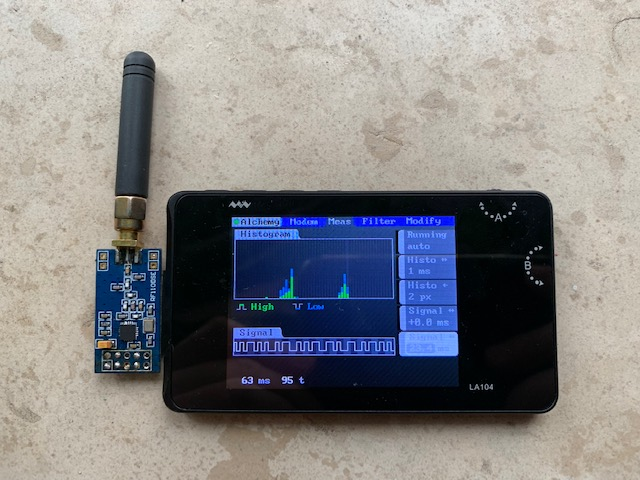

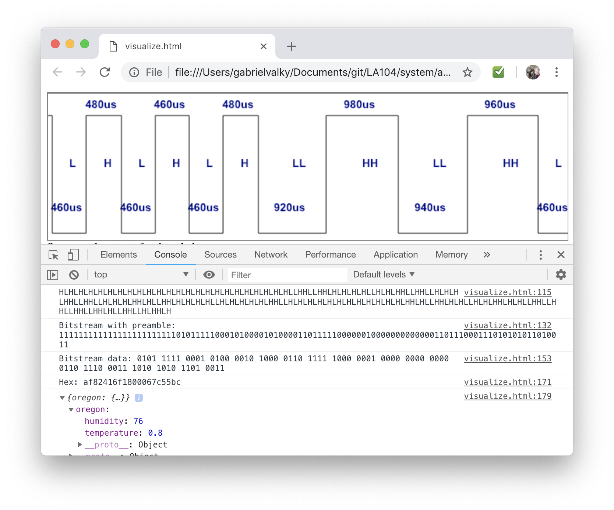

##### I2C Scanner application

I2C Scanner including database of 245 I2C devices, automatically shows description of identified device.

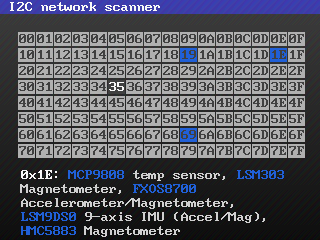

##### Pulseview compatibility

Added USB application which emulates sigrok SUMP protocol. By choosing "Openbench logic sniffer (ols)" in Pulse view configuration, LA104 can transfer measured signals to pulse view for deep analysis. Pulseview support wide range of protocols and offers intuitive user interface. Currently only 50kHz sampling is supported on P1..P4 pins, samplerate is sufficient for decoding of 9600 baud serial link.

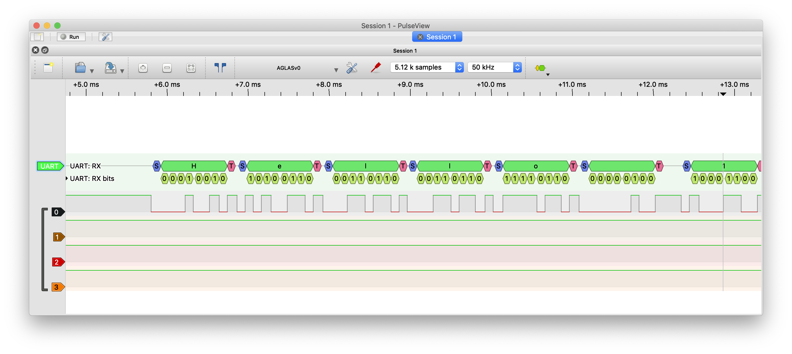

##### Graphical application chooser

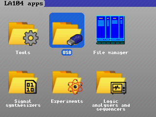

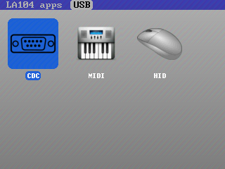

##### Stock logic analyser integration

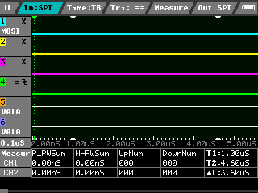

##### Logic sequencer app

16 channel logic analyser and sequencer. Generator of 4 bit pattern attached to CD4543 BCD to seven segment decoder. PCF8574 used as 16 bit expander

[](https://www.youtube.com/watch?v=D8OnXzE7OwU "LA104 logic sequencer")

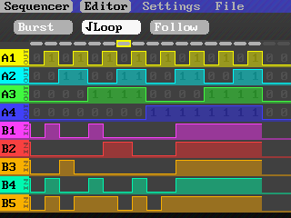

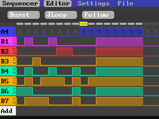

##### Midi player - midi parser and player

Connect your midi keyboard with two wires (3V and P1 through 100-330 ohm resistor).

[](https://www.youtube.com/watch?v=-MRcrPu_1kQ "LA104 midi player")

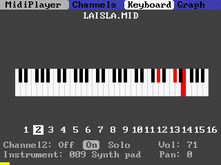

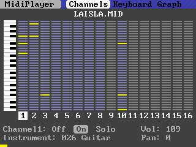


#### In this repository you will find

  - [resources](resources) - official resources from manufacturer, shematics and memory layout information
  - [experiments](resources/experiments) - the first simple applications to verify if we have proper toolchain, libraries, linker script and startup code
      - blink - When getting familiar with new hardware platform, this is the most common application - just blink a LED attached to P1 port. It is worth noting that the P1..P4 pins are connected always to two different IO pins of the MCU. This allows you to use each pin as general purpose IO pin, or as UART or I2C bus signal. For example pin P1 is connected to MOSI_PB15 and T23_TX3_SCL2_PB10. And P2 is connected to MISO_PB14 and T24_RX3_SDA2_PB11. So be very careful when configuring the IO pins so you won't create a short circuit 
    - triangle_oldlib - code taken from DS203 project. Draws simple sierpinski fractal to test LCD in C language
    - triangle_newlib - the same code, but with new library (2012 instead of 2008), this library is taken from official LA104 firmware project  
    - triangle_cpp - the same code, but in C++ with linker script that supports C++ features
    - worm - project taken from DS203, simple worm game but the controls are not very intuitive. Just a demonstration of simple event based window system
    - dynamic_simple - first step towards building own operating system, main application ELF just calls few imported functions (Test1, Test2, Test3, Test4). Imported library (shared object) has only empty implementation of those functions Test1..Test4 functions so the linker won't shout at us during compilation. Then by using [tools/elfdump](tools/elfdump) utility, a C code [dump.c](experiments/dynamic_simple/dump/dump.c) is generated which shows what will be loaded in which memory regions during ELF load process. [Secondary application](experiments/dynamic_simple/secondary/main.c) then calls this generated code and matches all imports into real functions
    - dynamic_advanced - the same, but this time the code is organized in three folders - library, host and client application. Instead of dummy functions, this time imported functions are putpixel and random.
  - [official_fw_gcc](resources/official_fw_gcc) - official LA104 firmware ported to use GCC compiler. No need to use IAR workbench. Only slight changes were done in the code - e.g. replacing sprintf function with malloc independent version of this function. 
  - tools - various commandline tools
    - [dfuload](tools/dfuload) - DFU load utility mentioned before
    - [elfstrip](tools/elfstrip) - utlity to remove unnecessary parts from ELF file
    - [elfdump](tools/elfdump) - shows some information about ELF file structure and dumps used memory regions as C code
  - [system](system) - LA104 custom firmware / operating system 
    - [bin](system/bin) - here you will find main firmware HEX file (manager.hex) and few interesting applications. At first flash the manager.hex in DFU mode and after reboot, copy these ELF files to the device using USB cable
    - os_host - operating system implementation with file manager and ELF loader
    - os_library - dummy library used by client applications during linking
      - test1_noimport - simple application without importing any symbols. Just uses LA104 bios to draw some image. For testing whether the ELF file was properly generated and stripped and if it loads succesfully
      - test2_import - the same application, but it imports BIOS::KEY::GetKey to properly exit the application when pressing second button and BIOS::LCD::PutPixel instead of using LA104 bios function
      - test3_gui - some simple GUI rendering, with text drawing and windows
      - test5_blink_hex - instead of ELF, this is just bare HEX file which is loaded into RAM to prevent FLASH rewrites. Just blinks the LED attached to P1 pin
      - test6_pwm_hex - first experiments with configuring 4 channel PWM, as well as previous program it loads the code into RAM. After finetuning and transferring the PWM code into host app, test7_pwm_app was made
      - test8_ds_app - reads the scratchpad of DS1820 / DS18B20 thermometer and shows temperature reading using GPIO api calls developed in test5_blink_hex
      - test9_dht - the same but with DHT22 temperature / humidity sensor
      - test10_i2c_direct - again with core library files to configure I2C transceiver to interface with BMP180 (BMP085) barometric pressure sensor. After merging this support code into host app, test11_i2c_api was made
      - test12_uart_api - after adding support code to host, this is the api test for UART on pins P1 & P2 (no other pins support HW uart on LA104)
      - test16_cc1101 - CC1101 transceiver sniffing Oregon scientific weather station sensors
      - test11_i2c_api - interfacing BMP180 (BMP085) arduino library with I2C api calls
      - test14_apds9960 - again I2C communication with APDS9960 color sensor / gesture recognizer. This time with original sparkfun arduino library and sample code without almost any changes. Showing how to run your arduino code directly on LA104
      - test4_snake - just snake game, not easy to control with the rotating encoders
      - test7_pwm_app - gui application for controlling PWM outputs, great tool for playing with RGB leds
      - test13_mp3 - mp3 player gui application, works with MD_YX5300 module
      - test15_charmap - shows ASCII character table used by OS

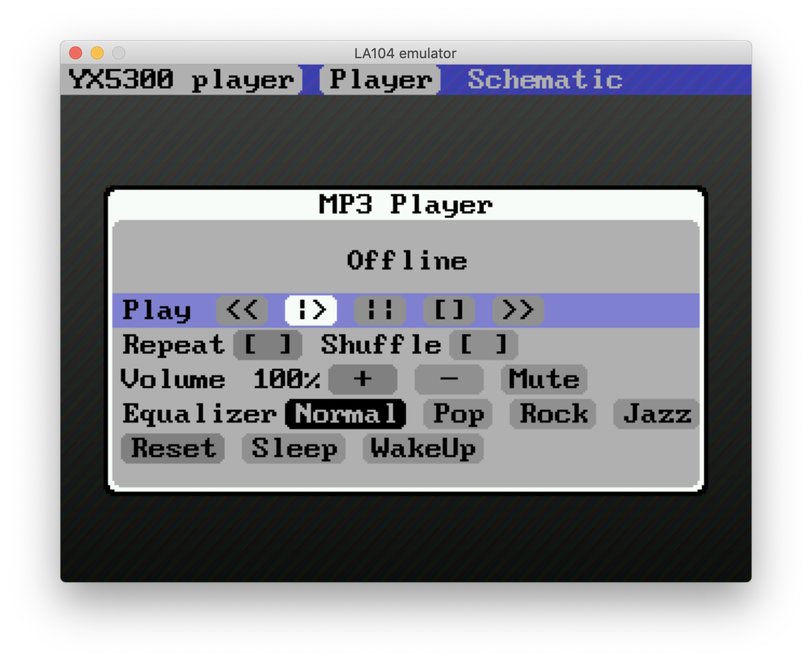

#### Screenshots

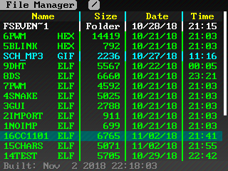

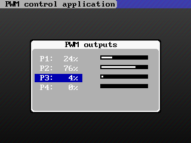

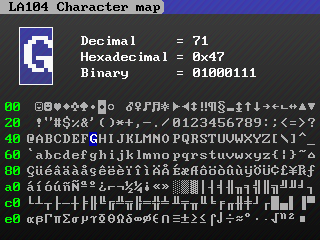

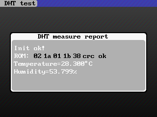


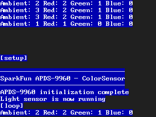

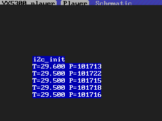

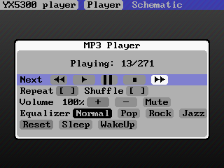


#### Finished Features
  - add snapshotting to host app - DONE (95% done, 23screen.elf)
  - C++ global variables memory placement, currently all variables on stack - DONE (100%, fixed linker script)
  - DS1820 network scanner app (50% done, 18onew.elf)
  - API signals: file added / fat changed, usb connection/disconnection (50% done, GetIntVect/SetIntVect)
  - PCF8574 sequencer + BCD to 7 segment test application (95%, 22sequen.elf)
  - midi player app (95%, 21mplay.elf)
  - USB toolkit - serial port, midi device, HID keyboard and mouse emulator, joystick (95%)
  - hybrid app using cmake (hybrid = app is running on desktop in synthetic environment)
  - Graphical shell with icons (90%)
  - separate file manager from host app (100%)
  - fix execution failures due to corrupted reads (100% caused by conflicting eeprom reads from usb&fat)
  - Fast USB streamer through CDC into web based PC app & some simple analysis (pulseview compatible protocol)
  - use external logical analyser app (sigrok / pulseview) emulating SUMP protocol (50%, for now just fixed sampling speed, consider attaching to stock logic analyser application)
  - USB CDC - USB to TTL interface (80%, only baudrate is supported, no flow control, no parity check)
  - automated generation of app root & including icons (50%, icons tbd)
  - universal IR remote control app (80% done, samsung compatible)
  - One wire temperature sensor grapher (90% done, drawing temperature chart of up to 8 sensors)
  - Analog oscilloscope using PCF8591 (90% done)
  - Test signal generator running in background for testing of logic analyser app (80% done)
  - swiss army knife for hardware engineers - package of applications that can talk to popular electronic devices (some samples are already there) and monitor any digital buses (logic analyser)
  - DCF77 decoding application with visualization (100%)
  - manual & text reader app (100%)
  - solve problem how to pass file as argument to app run through gui shell (100% only using file manager)
  - ESP8266 AP webserver using AT commands (100% simple webserver with file system listing, using promises)
  - GPIO tool (simple 8 channel visualizer/controller) with 4 channel PWM generator (100%)

#### TODO list
  - sometimes flashing new image fails, entry point address change usually helps
  - soft USB disconnection, so we do not need to disconnect cable to switch USB profiles
  - finish conversion of original firmware into ELF (80%)
  - optimize memory usage, switch to 500 byte clusters instead of 4k (2 buffers required => 8kb wasted), or share disk IO buffer from bios
  - obtain FPGA code from manufacturer 
  - setup FPGA build environment

#### Ideas
  - floppy disk drive over USB 
  - connect old graphic card with ISA interface through USB
  - CNC g code decoder and player

#### Abandoned ideas
  - remote control using ESP or BLE - possible to attach to UART0? (not possible, use USB CDC instead)
  - finish GIF loading, or consider other image formats (PCX, LBM, BMP?) - BMP won
  - working directory & relative paths (not important now)

#### Hardware improvement suggestions
  - add test pads for UART0 on PCB, this would allow various hardware mods
  - direction control pins of buffer 1DIR, 2DIR connected to FPGA, so we can synthesize fast signals - e.g. modify packets on the fly, mitm attacks, canbus slave device, etc///
  - larger eeprom
  - open sourced FPGA code

# Docker
The la104 images can be build using docker

The Dockerfile builds a container which runs build.sh.
build.sh executes the steps in the tutorial in the order presented.
build image using the dockerfile with the following commands.

```bash
docker build . -t la104
id=$(docker run -d --rm la104 sleep 300)
docker cp $id:/home/dev/output - > ./output.tar
tar -xvf output.tar
docker rm -v $id
```

